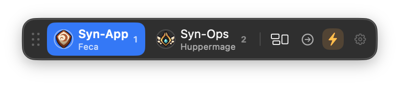
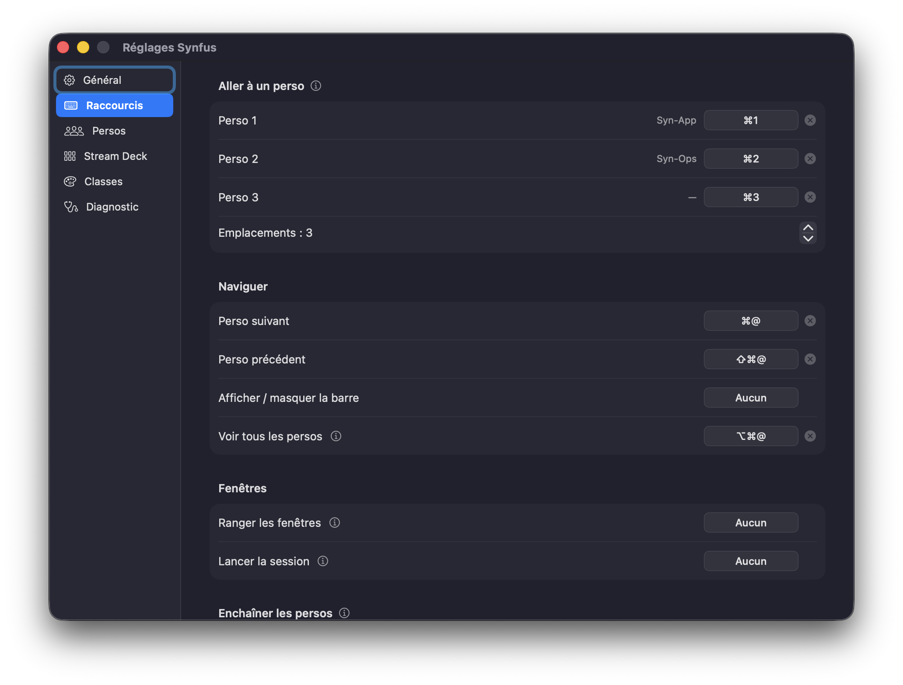

# Synfus

**Un switcher pour le multi-compte Dofus sur Mac.** Gratuit, open source.

Quand on joue plusieurs personnages, on veut souvent les prendre dans un ordre
précis : passer au suivant, revenir au précédent, aller directement sur celui
qu'on veut — sans chercher sa fenêtre à chaque fois. Il manquait ça sur Mac.
Synfus, c'est un petit overlay au-dessus de Dofus qui montre les personnages
connectés et permet de passer de l'un à l'autre, d'un clic ou au clavier.



## Ce que ça fait

- **Overlay des personnages** avec leur classe : un clic pour passer sur le
  bon compte.
- **Raccourcis clavier** : ⌘@ pour le personnage suivant, ⇧⌘@ pour le
  précédent, ⌘1, ⌘2… pour aller directement à l'un d'eux. Tout est modifiable
  (« @ » est simplement la touche sous Échap d'un clavier Mac français).
- **Détection du tour** : quand un personnage réclame la main, sa pastille
  clignote. On peut aussi choisir de basculer automatiquement dessus.
- **Mode « enchaîner »** : je clique sur un personnage, je fais mon action,
  puis Synfus passe au suivant. Pratique pour parcourir toute la team dans
  l'ordre — un clic par personnage, toujours.
- **Gestion des fenêtres** : côte à côte, mosaïque, un grand + vignettes,
  plein écran, « lancer la session ».
- **Fermeture propre des clients** : certains clients restent bloqués en
  quittant, Synfus s'en occupe.
- **Aperçu** d'une fenêtre au survol, ou de tous les personnages en maintenant
  ⌥⌘@.
- **Icônes de classe** à fournir soi-même (*Réglages → Classes*) : Synfus
  n'embarque aucune image du jeu. `./Tools/fetch-ankama-assets.sh` télécharge
  les emblèmes sur ta machine, pour ton usage personnel.

  > Certaines illustrations sont la propriété d'Ankama Studio et de Dofus
  > — Tous droits réservés.



Synfus ne joue rien à ta place : il n'envoie ni clic ni touche au jeu, il
change juste la fenêtre qui est devant. Pas de lecture mémoire, pas de réseau.
Il demande l'autorisation **Accessibilité**, et **Enregistrement de l'écran**
seulement si tu actives les aperçus.

## Stream Deck (optionnel)

Avec un Stream Deck Elgato, Synfus peut afficher les sorts du personnage
sélectionné et frapper la touche du jeu correspondante — les trois barres sous
dix touches grâce à trois niveaux d'appui. Totalement optionnel et désactivé
par défaut : *Réglages → Stream Deck* installe le plugin et fait apparaître
l'onglet *Sorts*.

## Installation

Récupérer le DMG correspondant à ta machine dans la page
[Releases](../../releases) :

| Mac | Fichier |
| --- | --- |
| Apple Silicon (M1 → M4) | `Synfus-<version>-arm64.dmg` |
| Intel | `Synfus-<version>-x86_64.dmg` |

Monter l'image, glisser **Synfus** dans **Applications**, puis lever la
quarantaine :

```sh
xattr -dr com.apple.quarantine /Applications/Synfus.app
```

Cette étape n'est pas facultative, et l'oublier ne se voit pas : l'app **se lance
normalement**, mais l'autorisation Accessibilité n'a alors aucun effet — la case
se coche dans les Réglages et Synfus continue de se dire non autorisé. L'attribut
suit l'app quand on la copie depuis le DMG : le retirer du DMG ne suffit pas.

Si l'app a déjà été lancée avant cette commande, l'entrée enregistrée ne
redeviendra pas valide ; il faut la réinitialiser :

```sh
tccutil reset Accessibility fr.synseria.Synfus
```

Tout cela tient à ce que les binaires publiés sont signés **ad-hoc** faute de
certificat *Developer ID* : macOS n'a aucune identité stable à leur associer et
se rabat sur l'empreinte du binaire, ce qui impose aussi de **réautoriser à
chaque nouvelle version**. Compiler depuis les sources l'évite entièrement.

Au premier lancement, autoriser Synfus dans **Réglages Système → Confidentialité
et sécurité → Accessibilité** : l'API d'accessibilité est ce qui permet de lire
les fenêtres des clients et de leur donner le focus.

Les aperçus de fenêtres, eux, réclament en plus **Enregistrement de l'écran** —
c'est la seule façon de capturer une image de fenêtre sur macOS. Ils sont
désactivés par défaut, et rien n'est capturé tant qu'ils le restent.

Compatible **macOS 14 (Sonoma) à macOS 26**. L'effet Liquid Glass de la barre
n'apparaît que sur macOS 26 ; en deçà, la barre utilise un matériau translucide.

## Compiler depuis les sources

```sh
./build.sh            # produit dist/Synfus.app
./build.sh --install  # installe dans /Applications et relance
swift test            # suite de tests
```

Deux variables d'environnement pilotent le script :

| Variable | Effet |
| --- | --- |
| `VERSION` | Numéro inscrit dans l'`Info.plist` (défaut : dernier tag du dépôt) |
| `ARCH` | Architecture cible, `arm64` ou `x86_64` (défaut : celle de la machine) |

`build.sh` signe avec le certificat local « Synfus Dev » s'il existe —
`./Tools/make-signing-identity.sh` le crée une fois — ou, à défaut, un
certificat *Apple Development* : l'identité vue par TCC reste alors stable d'un
build à l'autre, et l'autorisation Accessibilité n'est pas à redonner à chaque
fois. Le plugin Stream Deck est construit et embarqué dans l'app, mais jamais
installé par le script : c'est Synfus qui le propose.

Le DMG se fabrique à part :

```sh
./make-dmg.sh dist/Synfus.app dist/Synfus-0.0.1-arm64.dmg
```

Les tests se lancent avec `swift test`. Ils portent sur la logique pure —
analyse des titres de fenêtres, classes, raccourcis, persistance — et ne
touchent pas aux réglages de la machine.

L'icône est **dessinée par le code** plutôt que stockée comme image : la marque
est décrite une seule fois dans `Sources/Synfus/Marque/SynfusMark.swift`, d'où
sont tirés l'icône du bundle et le symbole de la barre de menus. Après toute retouche :

```sh
./Tools/generate-app-icons.sh   # régénère Resources/Synfus.{icns,png}
```

**La compilation exige le SDK macOS 26** (Xcode 26) : `BarView` appelle
`glassEffect`, absent des SDK antérieurs. Le deployment target reste 14.0, donc
le binaire produit couvre bien macOS 14 et suivants.

## Licence

Code sous licence [MIT](LICENSE). Les visuels du jeu ne font pas partie du
dépôt et n'en feront jamais partie : ils sont la propriété d'Ankama Studio et
de Dofus — Tous droits réservés —, et ne sont téléchargés que par l'utilisateur,
pour son usage personnel (voir *Icône par classe*). Synfus n'est ni affilié à
ni approuvé par Ankama.

## Publier une release

```sh
git tag v0.0.2
git push origin v0.0.2
```

Le workflow [`release.yml`](.github/workflows/release.yml) compile les deux
architectures sur un runner `macos-26`, fabrique les DMG et crée la release
GitHub avec les fichiers en pièces jointes.
