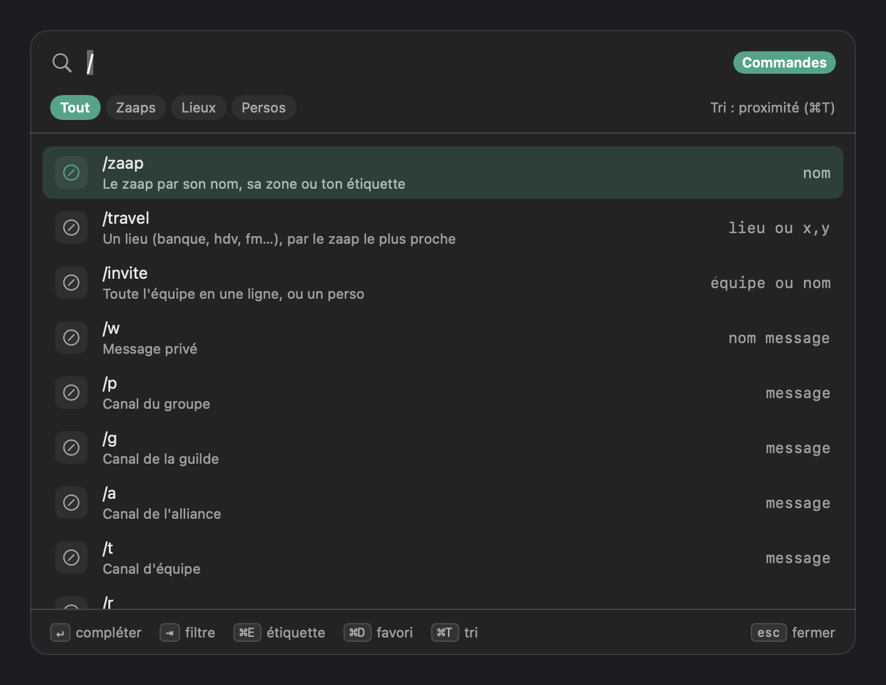
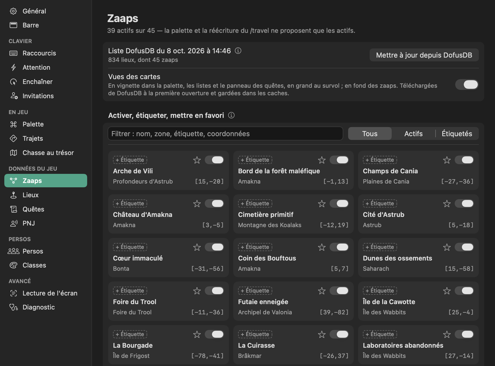
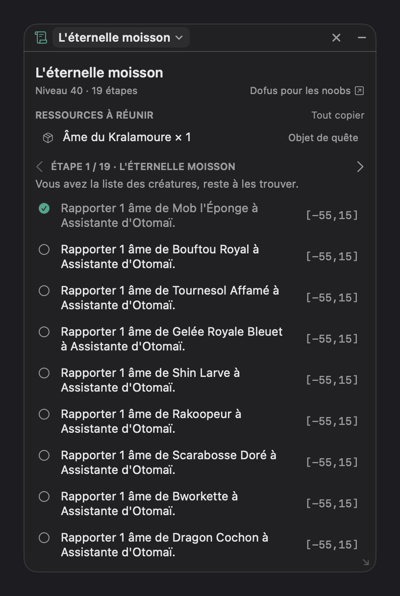
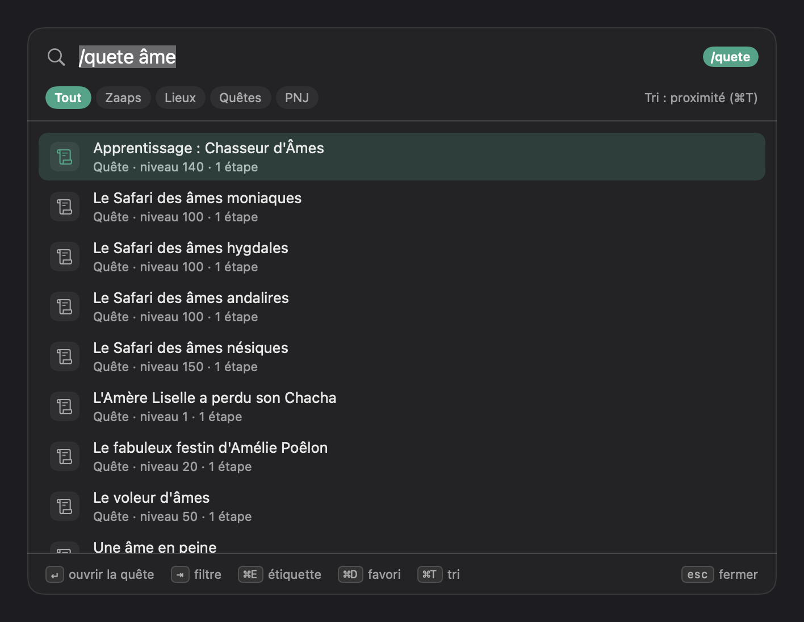
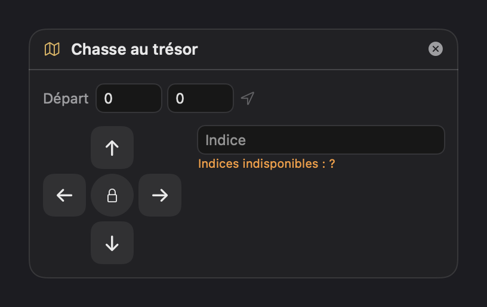
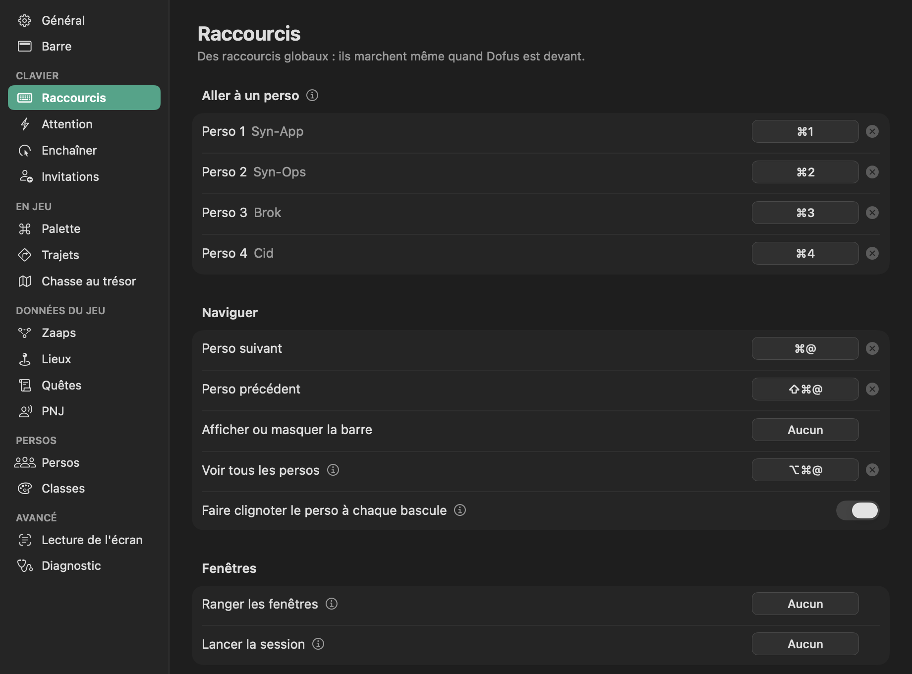
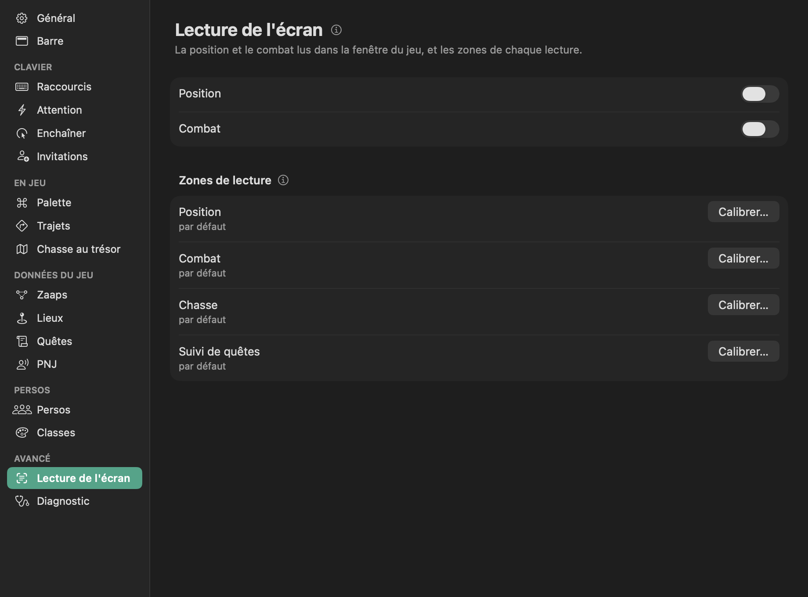

<div align="center">

# Synfus

**Le compagnon multi-compte de Dofus sur Mac.**
Passer d'un perso à l'autre, trouver un zaap, suivre une quête, résoudre une chasse —
sans quitter le jeu des yeux.

[](../../releases/latest)


[](LICENSE)

**[Télécharger](../../releases/latest)** · Gratuit · Open source · En français, anglais et espagnol


</div>

## En bref

- 🧭 **Une barre au-dessus du jeu** avec tes persos connectés : un clic ou ⌘1, ⌘2… pour passer de
  l'un à l'autre.
- ⌨️ **Une palette (⌘:)** pour tout trouver en tapant : zaaps, banques, ateliers, quêtes, PNJ,
  commandes du tchat.
- 🗺️ **Le bon zaap, tout seul** : un `/travel` devient `/zaap x,y ; /travel a,b`, par le zaap que
  le jeu rattache à la zone visée.
- 📜 **Les quêtes à côté du jeu** : étapes, ressources, positions, et le suivi du jeu reconnu à
  l'écran.
- 🧩 **La chasse au trésor** : une boussole, l'indice, et le `/travel` de l'étape suivante.
- 🤝 **Fair-play** : Synfus ne clique et ne tape jamais à ta place.

---

## 🧭 La barre des persos

Une petite barre flotte au-dessus de Dofus et montre chaque perso connecté, sa classe et son
numéro. Un clic, ou **⌘1, ⌘2…**, et sa fenêtre passe devant. **⌘@** pour le suivant, **⇧⌘@** pour
le précédent (la touche sous Échap d'un clavier Mac).

- **Son tour arrive ?** Sa pastille clignote, et Synfus peut basculer dessus tout seul.
- **Enchaîner au clic** : tiens `fn`, clique dans le jeu, et Synfus passe au perso suivant une fois
  le clic parti. Toujours un clic par perso.
- **Équipes** : à huit comptes, on joue rarement tout le monde ; glisse une pastille sur la seconde
  rangée pour composer jusqu'à quatre équipes.
- **Ranger les fenêtres** côte à côte, en mosaïque, un grand et des vignettes. **Aperçu** d'un perso
  au survol, ou de tous en maintenant ⌥⌘@.
- **Fermeture propre** des clients qui restent bloqués en quittant.

## ⌨️ La palette (⌘:)

Un champ de recherche s'ouvre au-dessus du jeu sans lui voler la place : tu tapes, **Entrée copie**,
**⌘V colle** dans le tchat.

<div align="center">

</div>

- **`/zaap bonta`** : un zaap par son nom, sa zone ou **ton étiquette** (« Fri 1 », « Koalak »),
  posée d'un ⌘E. ⌘D pour un favori. Rien de tapé : tes favoris, puis les plus proches de toi.
- **`/travel banque bonta`**, **`/travel fm`**, **`/travel hdv conso`** : les **834 lieux** du jeu —
  banques, hôtels de vente, ateliers, temples, donjons, transports —, le plus proche devant.
- **`/quete wogew`**, **`/pnj nom`** : les **1 976 quêtes** du jeu et les PNJ qu'elles situent.
- **`/`** les commandes du jeu, **`%`** les variables du tchat (`%pos%`, `%zone%`…), **`/invite`**
  toute l'équipe en une ligne, et chaque geste de Synfus (« ranger », « session »…).
- **Tab** filtre (Zaaps, Lieux, Quêtes, PNJ), **⌘T** trie par proximité, nom ou type.

<table>
<tr>
<td width="50%"></td>
<td width="50%"></td>
</tr>
<tr>
<td align="center"><sub>Le trajet copié passe par le zaap qui fait gagner du chemin</sub></td>
<td align="center"><sub>Les commandes et variables du tchat</sub></td>
</tr>
</table>

## 🗺️ Le bon zaap, tout seul

Copie un `/travel -20,9` depuis un site de cartes : Synfus le réécrit en
**`/zaap -16,1 ; /travel -20,9`**. Ta position est lue à l'écran, et le zaap choisi est celui que
le jeu rattache à la zone visée — celui des Koalaks, pas celui de Sidimote, plus proche à vol
d'oiseau mais derrière la montagne. Au raccourci, ou tout seul à chaque copie.

- Chaque zaap s'active ou se désactive (ceux que tu n'as pas encore), et s'étiquette.
- La carte du jeu vient de [DofusDB](https://dofusdb.fr), intégrée à Synfus et rafraîchie tous
  les 30 jours.

<div align="center">

</div>

## 📜 Les quêtes à côté du jeu

<table>
<tr>
<td width="46%"></td>
<td>

Épingle une quête depuis la palette : elle s'ouvre dans un **panneau transparent** qui reste
au-dessus du jeu sans lui prendre le clavier, et se cache quand tu quittes Dofus.

- **Les ressources à réunir**, avec leur catégorie — un clic copie le nom pour l'hôtel de vente.
- **Chaque étape** : sa consigne, ses objectifs ; un clic sur une position copie le trajet et
  **coche l'objectif**.
- **Ce que la quête exige** : classe, niveau, métier, alignement, « en groupe », « donjon ».
- **Les récompenses**, les **quêtes qui suivent**, et un lien vers *Dofus pour les noobs*.
- **Lire le suivi** : les quêtes de ton suivi en jeu sont reconnues à l'écran et s'épinglent
  d'un clic, à leur étape.

</td>
</tr>
</table>

<div align="center">

</div>

## 🧩 La chasse au trésor

<table>
<tr>
<td>

Une colonne étroite qui masque le moins de jeu possible. Le départ est ta position lue à l'écran ;
choisis la direction aux flèches du clavier, tape l'indice — ou fais-le **lire à l'écran** —, et
Synfus trouve la carte et copie son `/travel`. Les phorreurs sont signalés.

</td>
<td width="34%"></td>
</tr>
</table>

## ⚙️ Tout se règle

Raccourcis, réactions au tour, invitations, zones de lecture de l'écran — chacune **calibrée d'un
tracé** sur une capture de ton jeu, avec un essai de lecture en direct.

<table>
<tr>
<td width="50%"></td>
<td width="50%"></td>
</tr>
</table>

## 🤝 Fair-play

Synfus **ne joue rien à ta place** : il n'envoie ni clic ni touche au jeu, ne rejoue aucune
action sur plusieurs comptes, ne lit pas sa mémoire. Il change la fenêtre qui est devant, pose du
texte dans le presse-papiers — c'est toi qui colles —, et lit l'écran seulement si tu l'actives.
Sa seule source réseau est l'API publique de DofusDB.

Il demande l'autorisation **Accessibilité** (lire les fenêtres des clients et leur donner le
focus), et **Enregistrement de l'écran** seulement pour les aperçus et la lecture de l'écran.

---

## Installation

1. Télécharge le DMG de ta machine dans les [Releases](../../releases/latest) :

   | Mac | Fichier |
   | --- | --- |
   | Apple Silicon (M1 et suivants) | `Synfus-<version>-arm64.dmg` |
   | Intel | `Synfus-<version>-x86_64.dmg` |

2. Glisse **Synfus** dans **Applications**, puis, dans le Terminal :

   ```sh
   xattr -dr com.apple.quarantine /Applications/Synfus.app
   ```

3. Lance Synfus et autorise-le dans **Réglages Système → Confidentialité et sécurité →
   Accessibilité**.

<details>
<summary>Pourquoi l'étape 2, et si l'autorisation ne prend pas</summary>

Les versions publiées sont signées *ad hoc*, faute de certificat Developer ID. Sans retirer la
quarantaine, l'app se lance normalement mais l'autorisation Accessibilité reste sans effet : la case
se coche et Synfus se dit toujours non autorisé. Si l'app a été lancée avant la commande,
réinitialise l'entrée :

```sh
tccutil reset Accessibility fr.synseria.Synfus
```

La même signature *ad hoc* impose de réautoriser à chaque nouvelle version. Compiler depuis les
sources l'évite.
</details>

Compatible **macOS 14 (Sonoma) et suivants** ; l'effet Liquid Glass de la barre à partir de
macOS 26.

## Visuels du jeu

Synfus n'embarque aucun visuel de Dofus. Les emblèmes de classes et les vues des cartes sont
téléchargés par l'app depuis DofusDB, sur ta machine et pour ton usage personnel ; tu peux les
remplacer par tes images ou les masquer. Ils sont la propriété d'Ankama Studio et de Dofus — Tous
droits réservés. Synfus n'est ni affilié à ni approuvé par Ankama. Les captures de cette page sont
prises sans aucun visuel du jeu.

---

## Pour les développeurs

Une app AppKit + SwiftUI en Swift 6 (concurrence stricte), rangée par domaine dans
`Sources/Synfus/`. La carte du dépôt et ses règles sont dans [`CLAUDE.md`](CLAUDE.md), le détail
de chaque domaine dans `.claude/skills/`.

```sh
sh run.sh                    # build de développement, .build/dev/Synfus.app
sh run.sh --start            # … puis le lance
sh run.sh --install --start  # build release, installé dans /Applications et lancé
sh build.sh                  # build release : dist/Synfus.app
sh build.sh --release        # + dist/Synfus-<version>-<arch>.dmg
sh test.sh                   # suite de tests (sh test.sh Rotation : filtrée)
```

- **Xcode le plus récent requis** (Xcode 27, Swift 6.4) ; le deployment target reste macOS 14.
- **Tests** sur la logique pure (titres de fenêtres, raccourcis, zaaps, quêtes, OCR, préférences),
  sans toucher aux réglages de la machine.
- **Captures de cette page** : `SYNFUS_CAPTURES=$PWD/docs/screenshots sh test.sh CapturesTests` —
  les vues rendues hors écran sur des données d'exemple, sans aucun visuel du jeu.
- **Signature** (`signature.sh`) : Developer ID, sinon Apple Development, sinon le certificat local
  « Synfus Dev » (`Tools/make-signing-identity.sh`), sinon ad hoc — l'identité stable garde
  l'autorisation Accessibilité d'un build à l'autre.
- **Icône** dessinée par le code (`Sources/Synfus/Marque/SynfusMark.swift`) ;
  `Tools/generate-app-icons.sh` régénère `Resources/Synfus.{icns,png}`.
- **Traductions** : un fichier JSON par langue dans `Resources/Localisation/`, à corriger ou
  compléter d'une pull request.
- **Publier** : `sh build.sh --publish X.Y.Z` depuis `main` propre — tests, tag, DMG arm64 et
  x86_64, release GitHub aux notes tirées de [`CHANGELOG.md`](CHANGELOG.md).

## Licence

Code sous licence [MIT](LICENSE).
