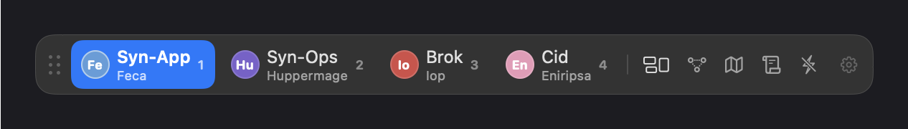
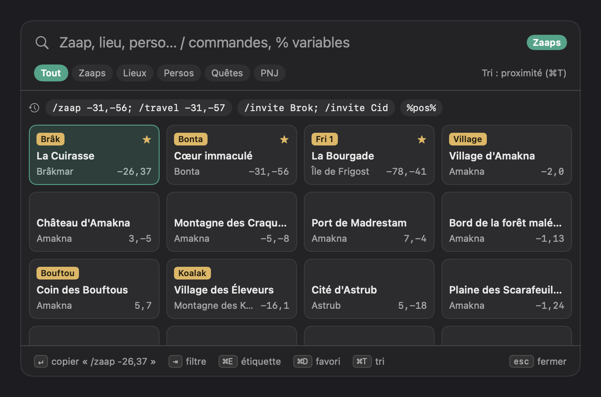
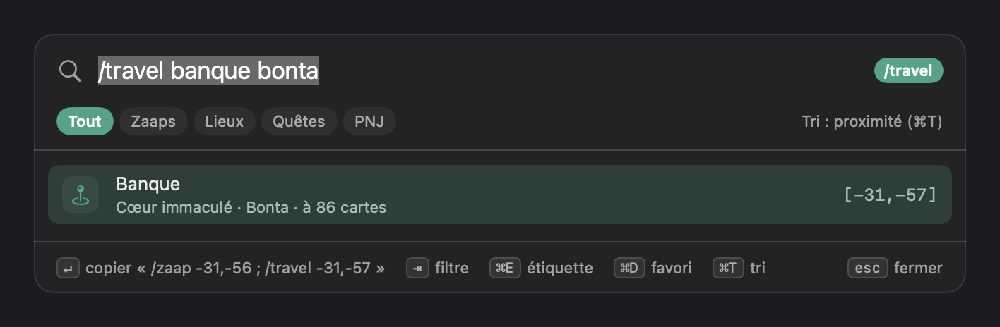
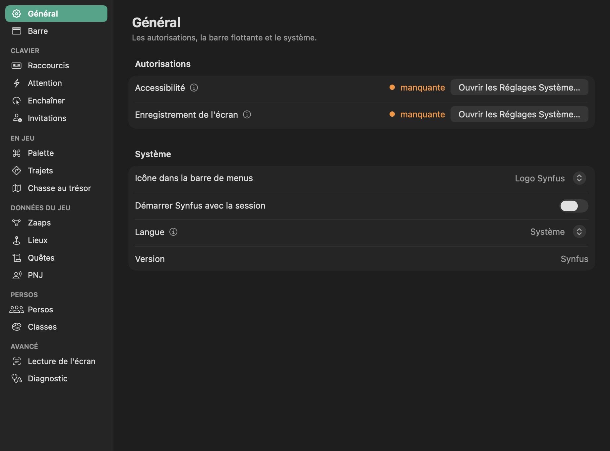

# Synfus

**Un switcher pour le multi-compte Dofus sur Mac.** Gratuit, open source.

Quand on joue plusieurs personnages, on veut souvent les prendre dans un ordre
précis : passer au suivant, revenir au précédent, aller directement sur celui
qu'on veut — sans chercher sa fenêtre à chaque fois. Il manquait ça sur Mac.
Synfus, c'est un petit overlay au-dessus de Dofus qui montre les personnages
connectés et permet de passer de l'un à l'autre, d'un clic ou au clavier.



## Ce que ça fait

- **La palette (⌘:)** : un champ de recherche au-dessus du jeu, qui prend le
  clavier sans passer devant Dofus. Tu tapes, Entrée copie, ⌘V colle dans le
  tchat.
  - `/zaap bonta` : le zaap par son nom, sa zone ou ton étiquette (« Fri 1 »).
  - `/travel banque bonta`, `/travel fm`, `/travel hdv conso` : les 834 lieux
    du jeu (banques, hôtels de vente, ateliers, temples, donjons, transports),
    le plus proche de toi devant, copiés en `/zaap x,y ; /travel a,b` quand
    le zaap fait gagner du chemin.
  - `/quete wogew` : un panneau transparent avec les ressources à réunir et
    chaque objectif — un clic copie le nom ou le trajet ; `/pnj nom` : la position des PNJ que les quêtes situent.
  - `/` les commandes du jeu, `%` les variables du tchat (`%pos%`…), `/invite`
    l'équipe en une ligne, et les gestes de Synfus.

  
  

- **Zaaps** : un `/travel` copié devient `/zaap x,y ; /travel a,b` quand un
  zaap épargne assez de cartes — au raccourci, ou tout seul à chaque copie.
  Ta position est lue à l'écran.
- **Chasse au trésor** : départ lu à l'écran, direction aux flèches, indice
  saisi ou lu ; la carte vient de DofusDB et son `/travel` est copié.
- **Overlay des personnages** avec leur classe : un clic pour passer sur le
  bon compte.
- **Raccourcis clavier** : ⌘@ pour le personnage suivant, ⇧⌘@ pour le
  précédent, ⌘1, ⌘2… pour aller directement à l'un d'eux. Tout est modifiable
  (« @ » est simplement la touche sous Échap d'un clavier Mac français).
- **Détection du tour** : quand un personnage réclame la main, sa pastille
  clignote. On peut aussi choisir de basculer automatiquement dessus.
- **Enchaîner au clic** : je tiens fn, je clique dans le jeu, et Synfus passe
  au personnage suivant une fois le clic parti. Pratique pour parcourir toute
  la team dans l'ordre — un clic par personnage, toujours.
- **Gestion des fenêtres** : côte à côte, mosaïque, un grand + vignettes,
  plein écran, « lancer la session ».
- **En français, anglais ou espagnol** : Synfus suit la langue de macOS, ou
  celle choisie dans ses réglages. Les traductions sont dans
  `Resources/Localisation/` — un fichier JSON par langue, à corriger ou
  compléter d'une pull request.
- **Équipes** (optionnel) : à huit comptes, on joue rarement tout le monde
  d'un coup. Jusqu'à quatre équipes, composées en glissant une pastille sur
  la seconde rangée de la barre ; l'équipe active restreint la barre, les
  raccourcis et le rangement, « Tous » reste à un clic.
- **Invitations** : ⇧⌘: copie `/invite Nom` pour le prochain personnage de
  l'équipe — ou toute l'équipe en une ligne —, tu colles dans le tchat (⌘V ↩).
  Synfus n'envoie rien au jeu — c'est toi qui colles.
- **Fermeture propre des clients** : certains clients restent bloqués en
  quittant, Synfus s'en occupe.
- **Aperçu** d'une fenêtre au survol, ou de tous les personnages en maintenant
  ⌥⌘@.
- **Icônes de classe** à fournir soi-même (*Réglages → Classes*) : Synfus
  n'embarque aucune image du jeu. `./Tools/fetch-ankama-assets.sh` télécharge
  les emblèmes sur ta machine, pour ton usage personnel.

  > Certaines illustrations sont la propriété d'Ankama Studio et de Dofus
  > — Tous droits réservés.



Synfus ne joue rien à ta place : il n'envoie ni clic ni touche au jeu, il
change juste la fenêtre qui est devant, et pose du texte dans le presse-papiers.
Pas de lecture mémoire ; pour le réseau, la seule API publique de DofusDB (la
carte du jeu, les quêtes et les indices de chasse, rafraîchis tous les 30 jours).
Il demande l'autorisation **Accessibilité**, et **Enregistrement de l'écran**
seulement si tu actives les aperçus ou la lecture de l'écran.

## Installation

Récupérer le DMG correspondant à ta machine dans la page
[Releases](../../releases) :

| Mac | Fichier |
| --- | --- |
| Apple Silicon (M1 → M4) | `Synfus-<version>-arm64.dmg` |
| Intel | `Synfus-<version>-x86_64.dmg` |

Monter l'image, glisser **Synfus** dans **Applications**, puis lever la
quarantaine :

```sh
xattr -dr com.apple.quarantine /Applications/Synfus.app
```

Cette étape n'est pas facultative, et l'oublier ne se voit pas : l'app **se lance
normalement**, mais l'autorisation Accessibilité n'a alors aucun effet — la case
se coche dans les Réglages et Synfus continue de se dire non autorisé. L'attribut
suit l'app quand on la copie depuis le DMG : le retirer du DMG ne suffit pas.

Si l'app a déjà été lancée avant cette commande, l'entrée enregistrée ne
redeviendra pas valide ; il faut la réinitialiser :

```sh
tccutil reset Accessibility fr.synseria.Synfus
```

Tout cela tient à ce que les binaires publiés sont signés **ad-hoc** faute de
certificat *Developer ID* : macOS n'a aucune identité stable à leur associer et
se rabat sur l'empreinte du binaire, ce qui impose aussi de **réautoriser à
chaque nouvelle version**. Compiler depuis les sources l'évite entièrement.

Au premier lancement, autoriser Synfus dans **Réglages Système → Confidentialité
et sécurité → Accessibilité** : l'API d'accessibilité est ce qui permet de lire
les fenêtres des clients et de leur donner le focus.

Les aperçus de fenêtres et la lecture de l'écran (position, tour de combat)
réclament en plus **Enregistrement de l'écran** — c'est la seule façon de
capturer une image de fenêtre sur macOS. Ils sont désactivés par défaut, et rien
n'est capturé tant qu'ils le restent.

Compatible **macOS 14 (Sonoma) et suivants**. L'effet Liquid Glass de la barre
n'apparaît qu'à partir de macOS 26 ; en deçà, la barre utilise un matériau translucide.

## Compiler depuis les sources

```sh
sh run.sh                    # build de développement, .build/dev/Synfus.app
sh run.sh --start            # … puis le lance
sh run.sh --install --start  # build release, installé dans /Applications et lancé
sh build.sh                  # build release : dist/Synfus.app
sh build.sh --release        # + dist/Synfus-<version>-<arch>.dmg
sh test.sh                   # suite de tests (sh test.sh Rotation : filtrée)
```

Chaque script répond à `--help`. Deux variables d'environnement pilotent
`build.sh` :

| Variable | Effet |
| --- | --- |
| `VERSION` | Numéro inscrit dans l'`Info.plist` (défaut : dernier tag du dépôt) |
| `ARCH` | Architecture cible, `arm64` ou `x86_64` (défaut : celle de la machine) |

La signature est choisie par `signature.sh` : un certificat *Developer ID*
s'il existe, sinon *Apple Development*, sinon le certificat local
« Synfus Dev » (`./Tools/make-signing-identity.sh` le crée une fois), sinon
ad hoc. L'identité vue par TCC reste ainsi stable d'un build à l'autre, et
l'autorisation Accessibilité n'est pas à redonner à chaque fois — mais
**changer d'identité la fait redonner une fois**.

Les tests se lancent avec `sh test.sh`. Ils portent sur la logique pure —
analyse des titres de fenêtres, classes, raccourcis, persistance — et ne
touchent pas aux réglages de la machine.

L'icône est **dessinée par le code** plutôt que stockée comme image : la marque
est décrite une seule fois dans `Sources/Synfus/Marque/SynfusMark.swift`, d'où
sont tirés l'icône du bundle et le symbole de la barre de menus. Après toute retouche :

```sh
./Tools/generate-app-icons.sh   # régénère Resources/Synfus.{icns,png}
```

**La compilation exige le Xcode le plus récent** (Xcode 27, Swift 6.4) : le
paquet déclare la dernière `swift-tools-version`, et `BarView` appelle
`glassEffect`, absent des SDK antérieurs à macOS 26. Le deployment target reste 14.0, donc
le binaire produit couvre bien macOS 14 et suivants.

## Licence

Code sous licence [MIT](LICENSE). Les visuels du jeu ne font pas partie du
dépôt et n'en feront jamais partie : ils sont la propriété d'Ankama Studio et
de Dofus — Tous droits réservés —, et ne sont téléchargés que par l'utilisateur,
pour son usage personnel (voir *Icônes de classe*). Synfus n'est ni affilié à
ni approuvé par Ankama.

## Publier une release

```sh
sh build.sh --publish 0.0.2   # depuis main propre et à jour : pose et pousse le tag v0.0.2
```

Le workflow [`release.yml`](.github/workflows/release.yml) compile les deux
architectures sur un runner `xcode-27`, fabrique les DMG et crée la release
GitHub avec les fichiers en pièces jointes.
